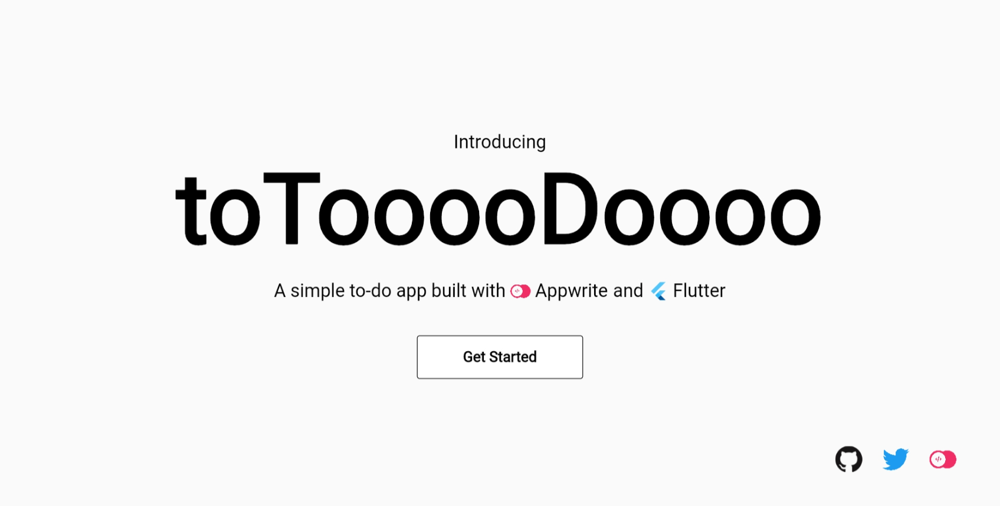
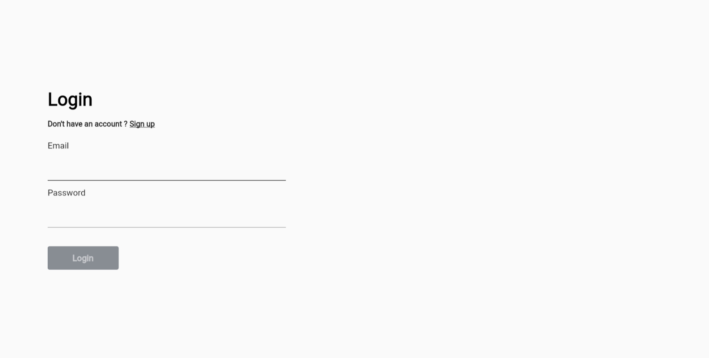
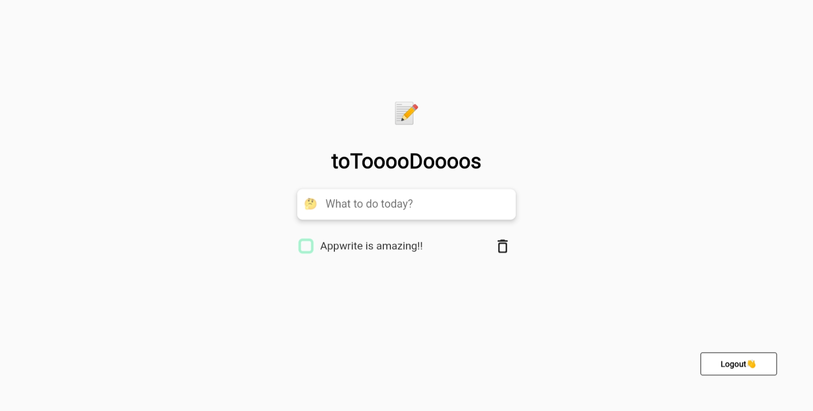

# Todo Appwrite

I recently came to know about appwrite and wanted try it out. I saw some todo examples but couldn't find any example for flutter, sooo...I made one❤
I tried to copy the UI of existing examples...

> Note: I haven't deployed appwrite yet😅 so you won't be able to use it.

## Screenshots

#### Landing Screen

#### Authentication Screen

#### Todo List  Screen

